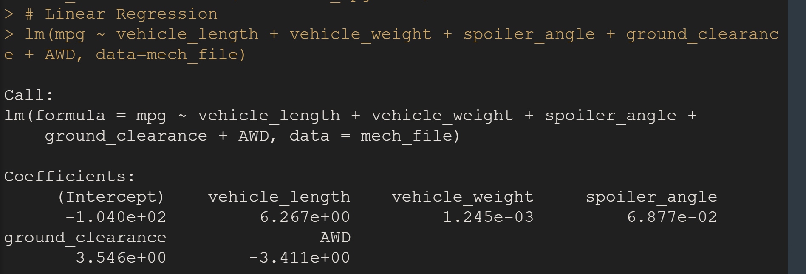
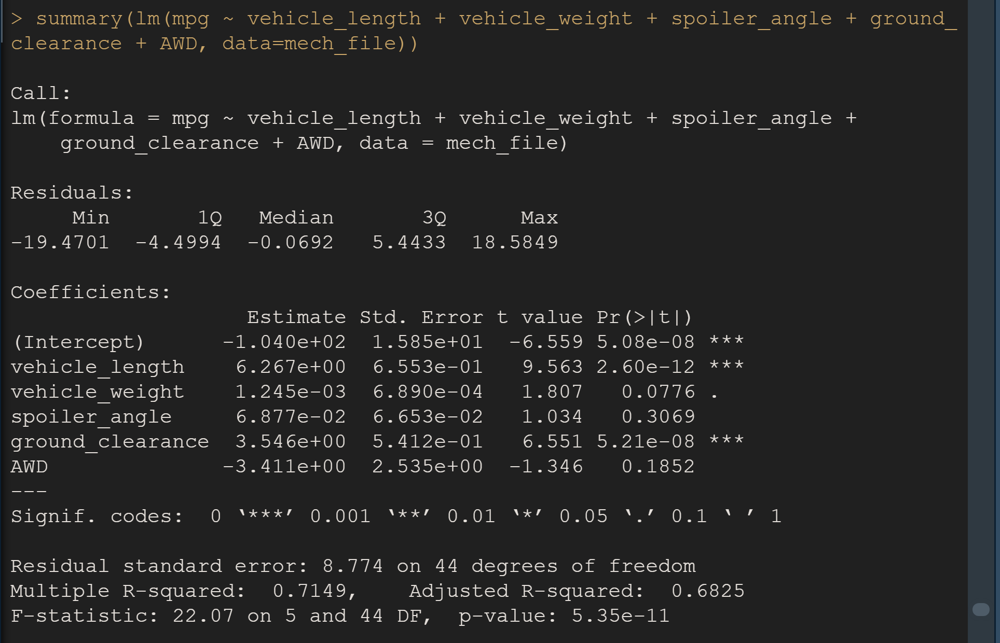
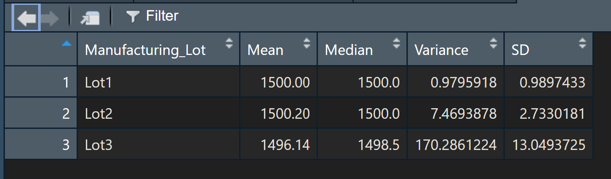
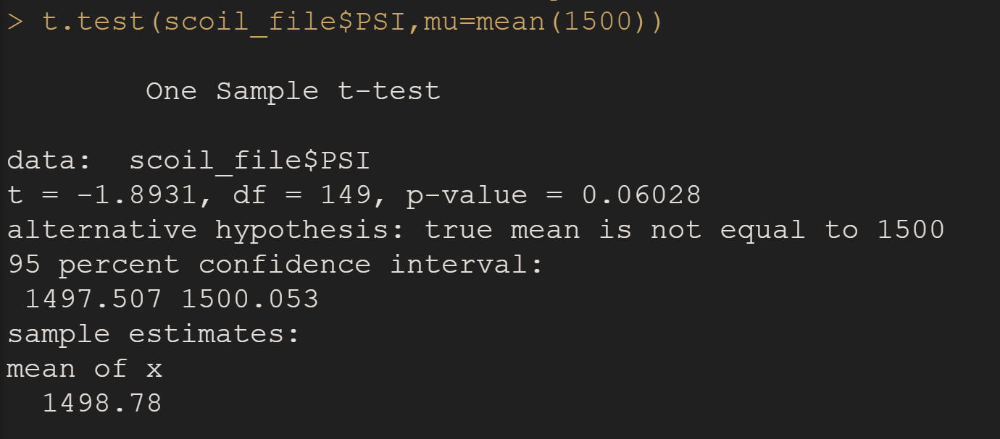
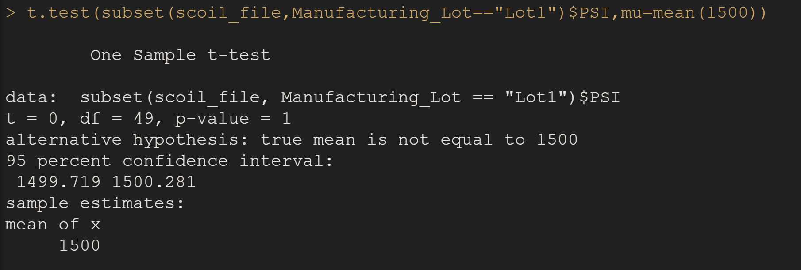
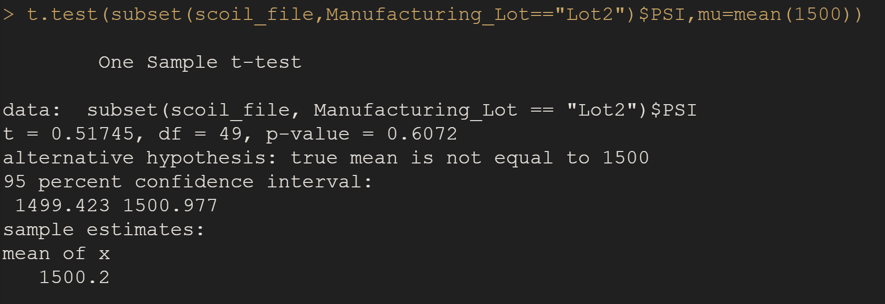
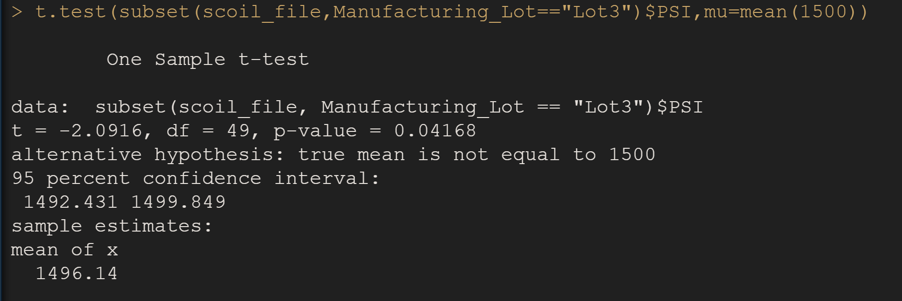

# Linear Regression to Predict MPG

- The slope of the linear model is not considered zero since the p-value is 5.35e-11, which is lower than the significance level of 0.05
- Multiple r-squared value is 0.7149. Therefore about 71.5% of all mpg predictions will be correct when using this linear model.

# Summary Statistics on Suspension Coils

- The results of manufacturing data reveals that the psi variance is 62.29, which meets design specifications.

- Breaking the results down by lot, we see that Lot3 fails to meet design specifications, as the variance is 170.29; exceeding the 100 psi limit.

# T-Tests on Suspension Coils

- Analyzing collective and individual Lots, we see that for Lot3 null hypothesis fails.

# Study Design: MechaCar vs Competition
An interesting metric would be looking at vehicle size and engine power. 
- H0: Vehicle size and engine power does not affect the consumer's decision to choose MechaCar over its competitors. 
- H1: Vehicle size and engine power does affect the consumer's decision to choose MechaCar over its competitors. 
